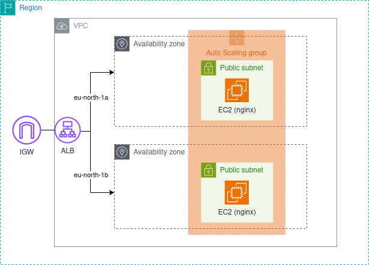

# Infrastructure Blueprint

A simple AWS infrastructure serving a static web page via an Application Load Balancer backed by an Auto Scaling Group, provisioned with Terraform and configured with Ansible.

🌐 **https://will-it-scale.in**

---

## Architecture



| Resource | Details                                                                 |
| -------- | ----------------------------------------------------------------------- |
| VPC      | `10.0.0.0/16`, 2 public subnets across `eu-north-1a` and `eu-north-1b`  |
| ALB      | HTTPS (443), HTTP redirects to HTTPS (301), ACM certificate via Route53 |
| EC2      | 2x `t3.micro`, Ubuntu 24.04, managed by Auto Scaling Group (1 per AZ)   |
| Access   | SSH tunneled through AWS SSM Session Manager — port 22 not exposed      |
| State    | Remote Terraform backend on S3 with native locking                      |

---

## Prerequisites

### Tools

- [Terraform](https://developer.hashicorp.com/terraform/install) >= 1.10
- [AWS CLI](https://docs.aws.amazon.com/cli/latest/userguide/install-cliv2.html) >= 2.0
- [Session Manager plugin](https://docs.aws.amazon.com/systems-manager/latest/userguide/session-manager-working-with-install-plugin.html)
- [Ansible](https://docs.ansible.com/ansible/latest/installation_guide/index.html) >= 2.12

---

## Getting started

### 1. Configure environment variables

Copy `.env.example` to `.env` and fill in your AWS credentials:

```bash
cp .env.example .env
```

```bash
export AWS_ACCESS_KEY_ID=...
export AWS_SECRET_ACCESS_KEY=...
export AWS_REGION=eu-north-1

# Optional: uncomment and set if using a named AWS profile
# export AWS_PROFILE=""

# Optional: defaults to ~/.ssh/infra-blueprint.pem
# export SSH_PRIVATE_KEY_PATH=~/.ssh/your-key.pem
```

> ⚠️ **Load the environment variables before getting started:**
>
> ```bash
> source .env
> ```

### 2. Retrieve the private key

The private key is stored in AWS SSM Parameter Store. Retrieve it with:

```bash
make get-key
```

### 3. Generate SSH config

```bash
make ssh-config
```

This generates an `ansible/.ssh_config` file used automatically by Ansible to tunnel SSH connections through AWS SSM Session Manager. No manual `~/.ssh/config` changes needed.

For manual SSH access to an instance:

```bash
ssh -F ansible/.ssh_config i-1234567890abcdef0
```

---

## Deploy

```bash
source .env
make init     # initialize Terraform
make apply    # provision infrastructure (~5 min)
make deploy   # configure instances with Ansible (~2 min)
```

> ⚠️ Allow ~2 minutes after `make apply` before running `make deploy` for instances to register with SSM.

---

## Available commands

| Command           | Description                                             |
| ----------------- | ------------------------------------------------------- |
| `make get-key`    | Retrieve private key from SSM Parameter Store           |
| `make ssh-config` | Generate SSH config for SSM tunneling                   |
| `make init`       | Initialize Terraform                                    |
| `make plan`       | Preview infrastructure changes                          |
| `make apply`      | Provision infrastructure                                |
| `make inventory`  | Regenerate Ansible inventory from running ASG instances |
| `make ping`       | Verify SSH connectivity to all instances                |
| `make deploy`     | Full Ansible deployment (inventory + playbook)          |
| `make destroy`    | Tear down all infrastructure                            |

---

## Design decisions

- **Public subnets only** — kept simple for this lab. In production, EC2 instances would sit in private subnets behind a NAT gateway, with the ALB as the only public-facing entry point.
- **Single shared route table** — both public subnets share the same route table since they have identical routing needs. In production with private subnets, each would have its own route table (one per NAT gateway for AZ-level HA).
- **Fixed ASG capacity** — `min = max = desired = 2` keeps the setup predictable. In production, scaling policies would be added based on CPU or request metrics.
- **SSM Session Manager** — EC2 instances are accessible via SSM tunnel instead of a public bastion host. Port 22 is not exposed to the internet.
- **HTTPS with ACM** — SSL is terminated at the ALB using an ACM certificate with DNS validation via Route53. HTTP traffic is permanently redirected to HTTPS (301).
- **S3 native locking** — Terraform state is stored in S3 with `use_lockfile = true` (requires Terraform >= 1.10), avoiding the need for a DynamoDB table (deprecated).
